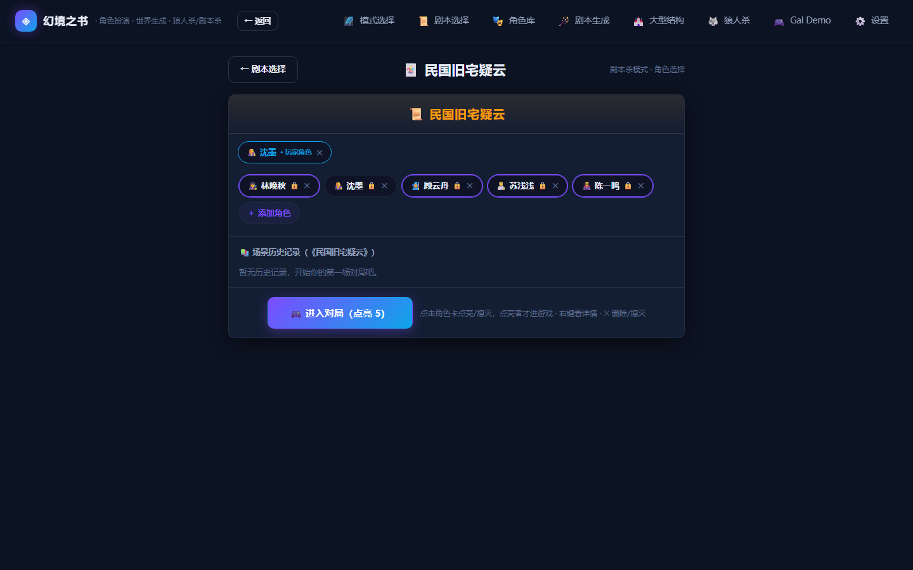
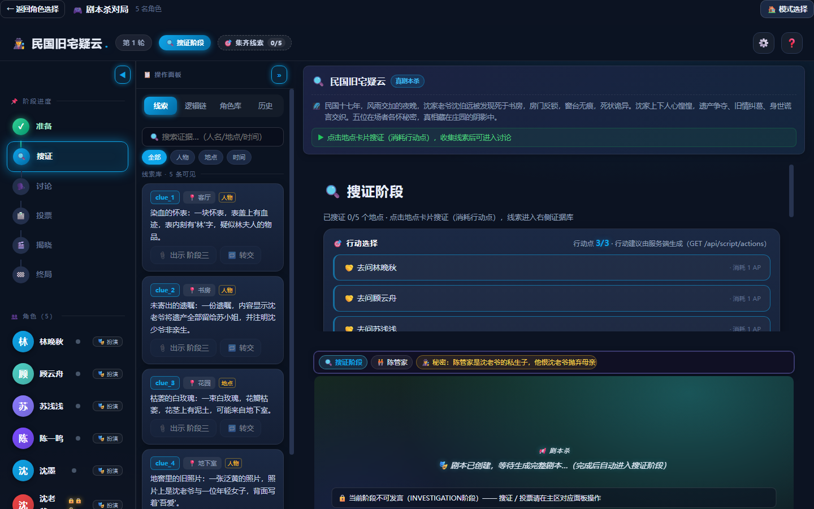
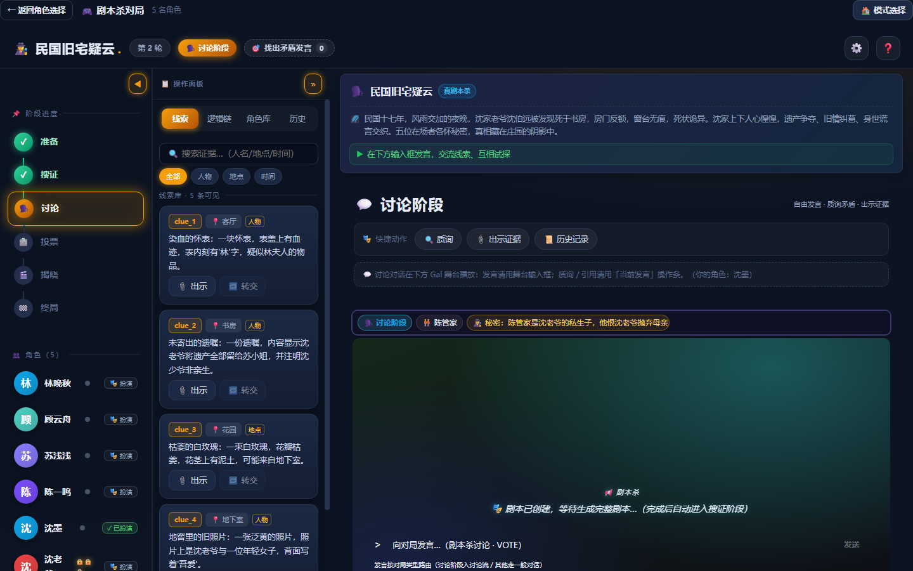
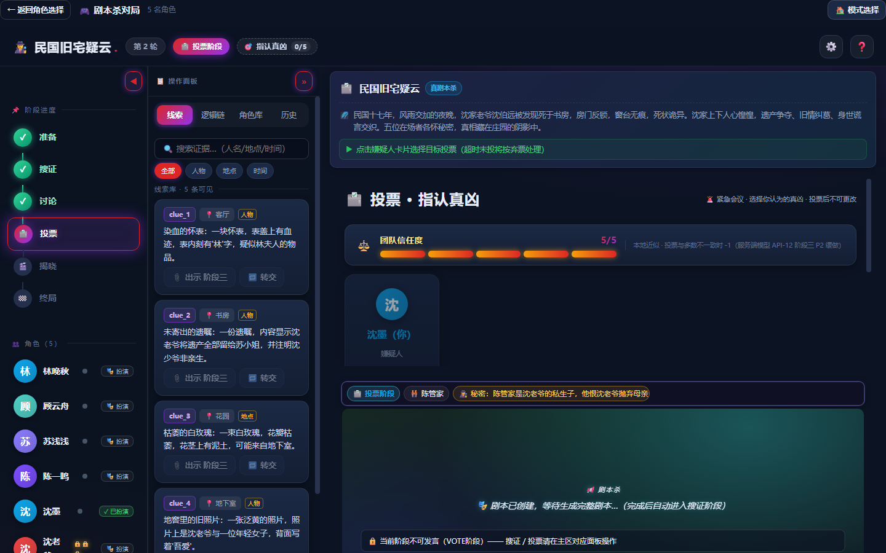

# 🎭 Roleplay Engine

> **AI characters that move, perceive, choose when to speak — and only know what they can actually hear.**

Roleplay Engine 是一个 Spatial Multi-Agent Social Simulation Engine：让多个 LLM 角色生活在同一个 2D 世界里。空间距离、听觉范围、私密房间和动机会共同决定：谁能互动、谁应该发言、谁能听见、每个角色究竟知道什么。

<p align="center">
  
  
  
  
  
  <a href="https://github.com/shuweiran/roleplay-java/actions/workflows/ci.yml"></a>
</p>

## 看到它在做什么

下面是实际运行的剧本杀流程；剧本杀和狼人杀不是项目身份本身，而是用来验证空间互动、发言门控和隐藏信息隔离的可玩场景。

| 角色选择 | 搜证 | 讨论 |
|---|---|---|
|  |  |  |

| 投票 | 揭晓 | 结束 |
|---|---|---|
|  |  |  |

## Speak → Hear → Know

多人 AI 最难的问题可能不是“让它们说话”，而是决定：谁现在应该闭嘴、谁真的听见了、谁不应该知道。

```text
                         2D WORLD
                            │
                 position / hearing / rooms
                            ↓
                 ┌────────────────────┐
                 │  WHO SHOULD SPEAK? │  SpeechGate
                 └──────────┬─────────┘
                            ↓
                 ┌────────────────────┐
                 │   WHO CAN HEAR?    │  Spatial Track Resolver
                 └──────────┬─────────┘
                            ↓
             ┌────────────────────────────────┐
             │ WHAT DOES EACH AGENT KNOW?    │
             │ MERGED / WEAK / ISOLATED      │
             └──────────────┬─────────────────┘
                            ↓
                         LLM AGENTS
```

### SpeechGate：不是所有 Agent 都要抢话

每轮先决定“是否发言”，再决定“说什么”。被点名、被提问、新线索、情绪事件和冷场破冰会触发发言；没有足够动机的角色可以保持沉默，直接跳过一次 LLM 内容生成。

### Spatial Track：空间决定上下文

`MERGED` 获得完整对话上下文，`WEAK` 只能获得旁听摘要，`ISOLATED` 不获得这段聊天内容，只能进行内心独白。Alice 和 Bob 在房间里私聊时，远处的 Charlie 不会自动知道原话；Charlie 靠近后也只会获得模糊摘要。

### Hidden Information：用游戏验证 Agent 能否保守秘密

狼人杀和剧本杀把信息隔离变成可验证的社会实验：狼人、平民、预言家、主持人和不同玩家应当看到不同事实；私聊不能泄漏，公开讨论仍然可以共享。

## 功能

- **Spatial social simulation**：移动、A* 寻路、碰撞、听觉范围、房间和地图热点真实影响 Agent 互动。
- **Selective speech**：SpeechGate 根据事件、动机、人格化 talkativeness 和等待偏置决定发言或沉默。
- **Context isolation**：World Director 与 Track Director 共同生成 `MERGED / WEAK / ISOLATED` 上下文。
- **Playable scenarios**：自由角色扮演、狼人杀、剧本杀完整流程。
- **Java backend + React frontend**：后端权威模拟，前端 Phaser 3.90 负责 2D 渲染和交互。
- **Supporting integrations**：OpenAI 兼容 LLM、MiMo TTS、ComfyUI 图片生成、REST/SSE、MCP 和审批门。

> Memory Retrieval、TTS 和图片生成是可选支撑能力；Memory 组件目前不是默认主链路，因此不把它包装成核心卖点。

## Quick Start

### 本地运行

前置：JDK 21、Maven 3.9+、Node.js 20+。

```bash
git clone https://github.com/shuweiran/roleplay-java.git
cd roleplay-java
export ROLEPLAY_LLM_API_KEY="your-api-key"
mvn -q package -DskipTests
java -jar target/roleplay-engine-1.0.0-SNAPSHOT.jar
```

打开 <http://localhost:8000>。不配置 Key 也可以运行测试和规则/BSP 降级路径。

### Docker

仓库包含完整的 `roleplay-v4/frontend` 源码，Docker 和 CI 使用同一份前端构建入口：

```bash
docker compose up --build
```

[](https://render.com/deploy?repo=https://github.com/shuweiran/roleplay-java)

### 前端开发

```bash
cd roleplay-v4/frontend
npm ci
npm run dev
npm run build
```

### 验证

```bash
mvn -q test       # 当前基线：988 tests / 0 failures / 0 errors / 0 skipped
cd roleplay-v4/frontend
npm run build
```

## 配置外部 AI 服务

本地默认仍使用 `application.yml` 和环境变量。运行后可通过设置页或统一接口覆盖当前进程配置：

```text
GET  /api/config/integrations   # provider 状态，不返回明文密钥
POST /api/config/integrations   # LLM / 地图 LLM / TTS / ComfyUI 图片配置
```

不保存外部覆盖时，默认本地配置不变。

## Architecture

```text
SimulationOrchestrator
  ├─ WorldDirectorService       → 角色此刻想做什么
  ├─ InteractionDetector       → 谁与谁发生社会互动
  ├─ TrackDirectorService       → MERGED / WEAK / ISOLATED
  ├─ MovementConstraint         → 聚集、听觉带、避让
  ├─ ConversationManager        → 对话组与轮次
  ├─ SpeechGate                 → 是否发言
  ├─ TrackStrategy              → 每个 Agent 的上下文
  └─ LLM + SSE                  → 生成行为并推送世界状态
```

```text
src/main/java/                 Java 后端、模拟、游戏规则、REST/SSE API
src/test/java/                 单元测试与集成测试
roleplay-v4/frontend/src/      React、Zustand、Phaser 2D 前端源码
src/main/resources/static/     Spring Boot 提供的前端构建产物
docs/                          架构契约、测试方案、问题清单和变更记录
work/full_play/                README 使用的真实流程截图
```

## Roadmap

- [x] SpeechGate：事件触发发言与低动机静默
- [x] Spatial Track：`MERGED / WEAK / ISOLATED` 上下文隔离
- [x] 2D 世界：移动、听觉、碰撞、地图与会话组
- [x] 狼人杀 / 剧本杀作为隐藏信息验证场景
- [ ] 录制 15–20 秒 Alice / Bob / Charlie 核心 Demo GIF
- [ ] 完善公开 Demo 与社区技术文章

## GitHub

仓库：[github.com/shuweiran/roleplay-java](https://github.com/shuweiran/roleplay-java)

推荐 Topics：`ai` · `llm` · `multi-agent` · `social-simulation` · `roleplay` · `game-ai` · `context-isolation` · `speech-gate` · `phaser` · `spring-boot`

推荐 About：

> Spatial multi-agent simulation where AI characters move, perceive, choose when to speak, and share context based on what they can actually hear.

## Contributing

欢迎提交 Issue、Pull Request 或新的社会模拟场景。请先阅读 [`AGENTS.md`](AGENTS.md)、[`PROJECT_CONTEXT.md`](PROJECT_CONTEXT.md) 和 [`DECISION_LOG.md`](DECISION_LOG.md)。

## License

[MIT](LICENSE)
