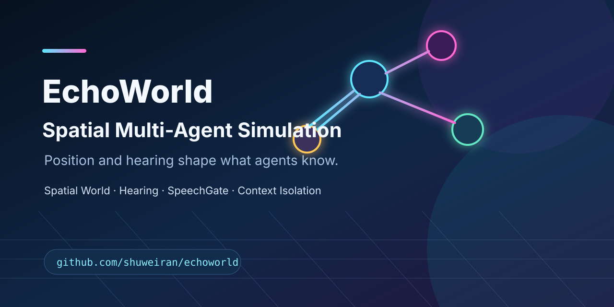

# EchoWorld

**Spatial Multi-Agent Simulation Engine**

EchoWorld 是一个 Java 21 / Spring Boot / React / Phaser / Babylon.js 项目：多个 AI Agent 位于同一权威空间世界，位置、距离、听觉和障碍决定它们能否互动，以及各自能够获得哪些上下文；同一状态可由 2D 调试视图或 3D 游戏视图呈现。



## What it demonstrates

1. **Spatial World** — 后端维护坐标、碰撞、地图、移动和会话的权威状态；前端只渲染和提交输入。
2. **Hearing** — `HearingSystem` 结合距离、听觉范围和声学障碍计算可听关系。
3. **SpeechGate** — 先以确定性规则决定“谁应当说话”，再调用 LLM 生成必要语言内容。
4. **Context Isolation** — 空间关系映射为 `MERGED`（完整上下文）、`WEAK`（受限主题摘要）和 `ISOLATED`（无会话信息）。

狼人杀、剧本杀和自由角色扮演仅是验证隐藏信息与社会互动边界的示例场景。

## Architecture

```text
Phaser 2D ─┐
Babylon 3D ├─ React debug client → REST + SSE ─┐
           │                                   ├─ Spring adapters → Java World Runtime
Unity 6 ───┘ formal client → WebSocket delta ─┘                    ├─ deterministic rules
                                                                   └─ optional LLM planning/language
```

世界内核按职责分层：静态 `WorldDefinition` 与运行态事实分离，`Transform3D/NavLocation` 保存权威空间，Grid 或 baked NavMesh 后端负责平面路径，Semantic Portal 负责跨楼层连接，`MovementSystem` 只执行；玩家输入与 AI 自主链路互斥。Utility/Skill/可选 LLM Planner 只能提交 `ActionIntent`，请求进入世界 tick 的单写入者 FSM，并在执行及跨 tick 推进前按 world version、控制权、目标和 Affordance 复验，最后产生确定性的 `ActionResult/Event`。

多楼层地图以 `floorId + x + y` 表达领域位置：旧地图自动归一为 `ground`，跨楼层路线由楼层内 Grid A* 与合法 connector graph 组合，只有抵达 connector 的 world tick 才能切层。`HearingSystem` 按楼层、墙体与声学 connector 计算衰减，Speech Commit 在落地 tick 重新读取双方楼层与 connector 状态，`SpatialTrackResolver` 复用同一可听结果，避免同 XY 的封闭楼层泄漏原话。

客户端只持有投影。WebSocket v1 提供 interest-filtered full snapshot、delta frame、ACK/replay/full-resync；慢客户端发送在有界复制 worker 中执行，不阻塞权威 tick。世界 checkpoint、低频 durable event、运行指标和 JFR 事件用于恢复与诊断。

Babylon 3D 支持第一人称与第三人称即时切换：第一人称绑定玩家眼位并隐藏自身模型，第三人称提供跟随、自由观察、缩放和摄像机碰撞。两种视角的 WASD 都只转换为镜头相对的显式玩家输入，摄像机和 AI 都不能直接修改玩家位置。

核心调用链为：`SimulationOrchestrator` → `SpatialTrackResolver` → `ConversationManager` → `SpeechGate` → `TrackStrategy` → `LLMClient`。详细职责、依赖边界和已知技术债见 [Architecture](docs/architecture.md)。

## Verify the core claims

- 隔离 Agent 不得收到私密会话原文；
- `WEAK` 旁听者不接收秘密关键词；
- 距离与隔音墙会改变 Track；
- 非法地图被拒绝或走确定性降级；
- SSE 重连不泄漏其他会话状态。
- 2D/3D 切换不改变服务器位置、碰撞、听觉或 Track 判定。
- AI 目标由服务端 NavigationService 规划；当前 Grid A* 是可替换后端。玩家输入不进入 AI 导航、日程、导演或群体力系统。路径航点作为世界快照的一部分供 3D 调试与表现层消费。
- 多楼层回归覆盖 legacy map、三层 connector、替代楼梯/不可达、合法切层、跨层声学衰减、Speech Commit 楼层竞态与 2D/3D 投影不变量。
- WebSocket 只复制服务端允许的字段；客户端不能提交坐标、门状态或 Action 成功结果，缺帧必须 ACK/replay 或 full resync。
- 50/100/200 Agent cognitive LOD 档位有确定性 smoke test；远距 Agent 进入 Macro 模式，不调用 LLM 或逐步 Skill。

对应入口：[Context Track](docs/concepts/context-routing.md)、[Testing](docs/testing.md)、[Evaluation](docs/evaluation.md)。固定三角色演示规范见 [Three-agent demo](docs/demo-three-agent.md)；它目前是可复现规格，公开录屏仍在 Roadmap 中。

## Quick start

Prerequisites: JDK 21、Maven 3.9+；前端开发另需 Node.js 20+。

```bash
git clone https://github.com/shuweiran/echoworld.git
cd echoworld
mvn test
mvn package -DskipTests
java -jar target/roleplay-engine-0.1.0.jar
```

Open `http://localhost:8000`. LLM credentials are supplied by environment variable, for example `ROLEPLAY_LLM_API_KEY`; normal test runs use mock/fallback clients and do not require a real provider.

```bash
cd frontend
npm ci
npm run build
```

## Scope and limitations

- 50/100/200 Agent 已覆盖认知 LOD smoke profile；这不是生产规模、长时在线或多机扩展承诺，仍需持续压测。
- Babylon.js 提供程序化低模场景、Capsule 回退角色，以及本机私有 GLB/PMX 玩家模型加载与程序化 Idle/Walk/Run/Talk 骨骼表现；私有模型目录受 Git 忽略且不随公开仓库分发。服务端已有 baked NavMesh 图查询和多楼层 Semantic Portal；离线 Recast 烘焙工具链、Crowd/动态 TileCache、公开标准角色资产与正式动画片段仍待完成。
- `unity-client/` 已迁移到 Unity `6000.3.23f1_09d2ecc7fb28` 并完成真实 Editor 验证：EchoWorld EditMode 13 项全绿，PlayMode 通过本机真实 WebSocket 环回验证 `hello → full_snapshot → WorldReplica → ACK`；Java `/ws/world` 也已通过 RANDOM_PORT 真端点测试。Unity 客户端直连 Java 测试实例、断线重连和远程 Addressables catalog 仍待补充。
- Language generation is nondeterministic; movement, permissions, collision, Track and game state are deterministic.
- H2 is the local single-machine persistence choice, not a production database claim.
- This is not a GIS or remote-sensing production system: CRS, GeoJSON/Shapefile, raster processing and hydrological models are not implemented.
- `SimulationService`, `SimulationController` and `ConversationManager` remain planned responsibility-splitting targets；旧入口通过 strangler adapter 逐步迁移，不做一次性重写。

## Roadmap

- Record the 20–30 second three-agent spatial-context demo.
- 补 Unity↔Java RANDOM_PORT 直连、WebSocket 断线重连与 Addressables 远程资源验证。
- 补离线 Recast/NavMesh 烘焙工具链、Crowd/动态障碍，并发布持续负载下的容量与延迟基线。
- 接入许可清晰、可公开分发的标准 GLB 人物资产，并用正式 Idle/Walk/Run/Talk 动画片段、动画混合与 LOD 替换本机程序化降级表现。

## Assets and license

Source code is [MIT](LICENSE). Dependencies and any retained third-party assets keep their own licenses. On 2026-08-25, two audit-confirmed third-party tiles lacking repository attribution were removed rather than relicensed implicitly. New distributable assets must have documented provenance and license terms，并登记到 [Asset licenses](docs/assets/ASSET_LICENSES.csv)。
